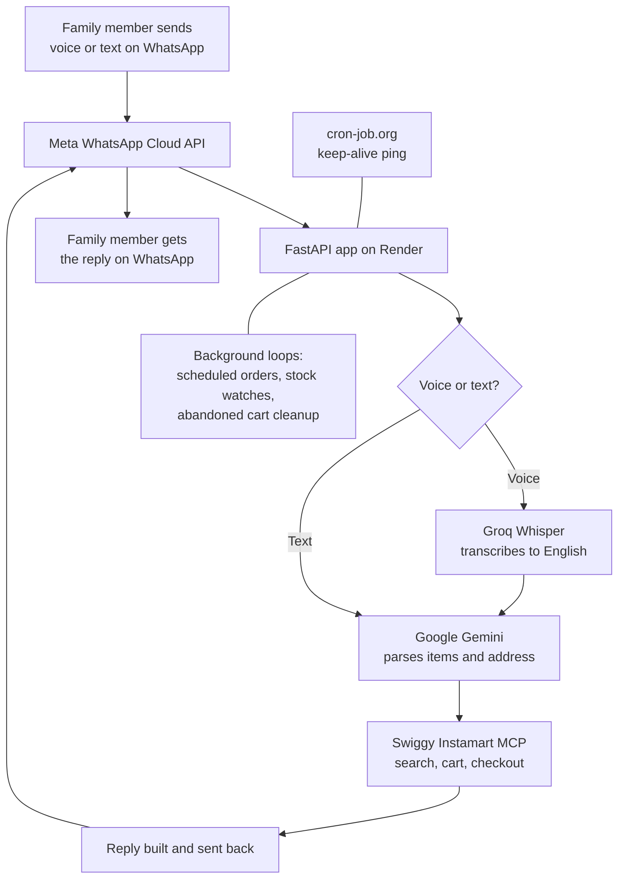

# WhatsApp Grocery Ordering Bot

A voice/text WhatsApp bot that lets family members order groceries on
Swiggy Instamart just by messaging a bot number — in Hindi, Hinglish,
or English. Built for non-technical users (e.g. elderly parents): no
app to install, no login, just a WhatsApp contact.

## How it works, in one sentence

WhatsApp voice/text → transcribed (Groq Whisper) → parsed into
structured items (Google Gemini) → searched and priced on Swiggy
Instamart (Swiggy MCP) → confirmed with the person → added to cart or
ordered for real, with several safety nets in between.

## Architecture

The top-to-bottom path is every message's actual journey. The two side
notes — background loops and the keep-alive ping — support the main
flow but aren't part of any single message's path, which is why
they're kept separate rather than looped back into the diagram.

## What's in this repo

| File / folder | What it is |
|---|---|
| `main.py` | The whole bot — FastAPI webhook server, all logic |
| `swiggy_login.py` | One-time (well, every ~5 days) Swiggy login script |
| `requirements.txt` | Python dependencies |
| `Procfile` | Tells a hosting platform how to start the app |
| `.env.example` | Template for your own `.env` — copy and fill in |
| `.gitignore` | Keeps secrets and local state out of git |
| `docs/` | All setup, deployment, and reference documentation |

## Where to start

1. **[docs/01_META_WHATSAPP_SETUP.md](docs/01_META_WHATSAPP_SETUP.md)** — get your WhatsApp Business number and API credentials from Meta. Do this first; nothing else works without it.
2. **[docs/02_LOCAL_SETUP.md](docs/02_LOCAL_SETUP.md)** — run the bot on your own machine for development and testing.
3. **[docs/03_DEPLOYMENT.md](docs/03_DEPLOYMENT.md)** — host it continuously (free, no sleep) so it doesn't depend on your laptop being on.
4. **[docs/04_COMMANDS.md](docs/04_COMMANDS.md)** — every command the bot understands, from the person's point of view.
5. **[docs/05_ARCHITECTURE.md](docs/05_ARCHITECTURE.md)** — how the code is structured, for whoever maintains this next (including future-you).
6. **[docs/06_TROUBLESHOOTING.md](docs/06_TROUBLESHOOTING.md)** — real issues hit during development, what caused them, and how they were fixed or worked around.

## Core features

- Voice or text ordering, in Hindi/Hinglish/English
- Multi-step confirmation before anything real happens (never a surprise order)
- A hard spending cap (`MAX_ORDER_AMOUNT`, default ₹500) blocking real checkout above it
- Real price transparency — shows actual fees (handling, delivery, GST), not just item totals
- Automatic coupon application when available on the account
- "clear cart", "what's in my cart", "repeat the order", and "help" — usable anytime, by anyone
- Scheduled orders (e.g. "schedule 8pm"), restricted to a safe 6 AM–10 PM window
- Multiple family members can use the bot independently — the one shared Swiggy cart is handled safely, without one person's order silently overwriting another's

## A safety note before you use this for real

This bot can place real orders with real money on a real Swiggy
account. Read `docs/06_TROUBLESHOOTING.md` before relying on it —
several real near-misses during development are documented there,
along with the fixes. Keep `MAX_ORDER_AMOUNT` low until you fully
trust it in practice.

## Contributing

Contributions and bug reports are welcome - see
[CONTRIBUTING.md](CONTRIBUTING.md) for how this project is organized
and what to know before touching the order/checkout path. This
project follows a [Code of Conduct](CODE_OF_CONDUCT.md).

## Security

Found a security issue? Please don't open a public issue - see
[SECURITY.md](SECURITY.md) for how to report it responsibly.

## License

[MIT](LICENSE) (c) 2026 Pratyush Vatsa

